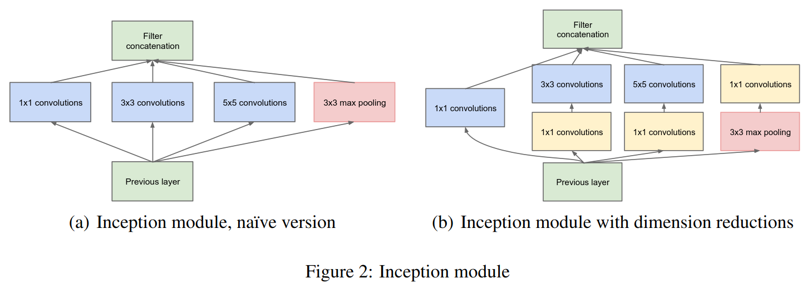
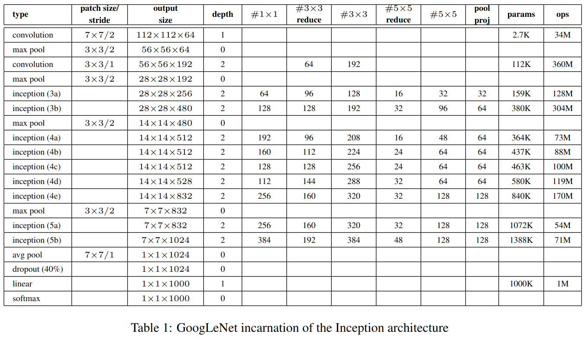
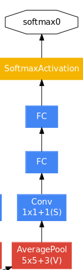

# GoogleNet
The code is a modified version of the official [googlenet implementation](https://github.com/pytorch/vision/blob/main/torchvision/models/googlenet.py) on Pytorch.

This code is fairly verbose, but relatively clean, let's go top API to bottom internal.

## googlenet
```python
@register_model()
@handle_legacy_interface(weights=("pretrained", GoogLeNet_Weights.IMAGENET1K_V1))
def googlenet(*, weights: Optional[GoogLeNet_Weights] = None, progress: bool = True, **kwargs: Any) -> GoogLeNet:
    """GoogLeNet (Inception v1) model architecture from
    `Going Deeper with Convolutions <http://arxiv.org/abs/1409.4842>`_.

    Args:
        weights (:class:`~torchvision.models.GoogLeNet_Weights`, optional): The
            pretrained weights for the model. See
            :class:`~torchvision.models.GoogLeNet_Weights` below for
            more details, and possible values. By default, no pre-trained
            weights are used.
        progress (bool, optional): If True, displays a progress bar of the
            download to stderr. Default is True.
        **kwargs: parameters passed to the ``torchvision.models.GoogLeNet``
            base class. Please refer to the `source code
            <https://github.com/pytorch/vision/blob/main/torchvision/models/googlenet.py>`_
            for more details about this class.
    .. autoclass:: torchvision.models.GoogLeNet_Weights
        :members:
    """
    weights = GoogLeNet_Weights.verify(weights)

    original_aux_logits = kwargs.get("aux_logits", False)
    if weights is not None:
        if "transform_input" not in kwargs:
            _ovewrite_named_param(kwargs, "transform_input", True)
        _ovewrite_named_param(kwargs, "aux_logits", True)
        _ovewrite_named_param(kwargs, "init_weights", False)
        _ovewrite_named_param(kwargs, "num_classes", len(weights.meta["categories"]))

    model = GoogLeNet(**kwargs)

    if weights is not None:
        model.load_state_dict(weights.get_state_dict(progress=progress, check_hash=True))
        if not original_aux_logits:
            model.aux_logits = False
            model.aux1 = None  # type: ignore[assignment]
            model.aux2 = None  # type: ignore[assignment]
        else:
            warnings.warn(
                "auxiliary heads in the pretrained googlenet model are NOT pretrained, so make sure to train them"
            )

    return model
```

We start with the above which is fairly standard.

The part that matter the most is this one:
```python
    model = GoogLeNet(**kwargs)
```
Which simply call GoogLeNet class to create the model and shove all of the parameters. The rest is mostly just to load in the  weights.

Before getting into GoogLeNet class, let's explore the Inception module.

## Inception
```python
class Inception(nn.Module):
    def __init__(
        self,
        in_channels: int,
        ch1x1: int,
        ch3x3red: int,
        ch3x3: int,
        ch5x5red: int,
        ch5x5: int,
        pool_proj: int,
        conv_block: Optional[Callable[..., nn.Module]] = None,
    ) -> None:
        super().__init__()
        if conv_block is None:
            conv_block = BasicConv2d
        self.branch1 = conv_block(in_channels, ch1x1, kernel_size=1)

        self.branch2 = nn.Sequential(
            conv_block(in_channels, ch3x3red, kernel_size=1), 
            conv_block(ch3x3red, ch3x3, kernel_size=3, padding=1)
        )

        self.branch3 = nn.Sequential(
            conv_block(in_channels, ch5x5red, kernel_size=1),
            # Here, kernel_size=3 instead of kernel_size=5 is a known bug.
            # Please see https://github.com/pytorch/vision/issues/906 for details.
            conv_block(ch5x5red, ch5x5, kernel_size=3, padding=1),
        )

        self.branch4 = nn.Sequential(
            nn.MaxPool2d(kernel_size=3, stride=1, padding=1, ceil_mode=True),
            conv_block(in_channels, pool_proj, kernel_size=1),
        )

    def _forward(self, x: Tensor) -> List[Tensor]:
        branch1 = self.branch1(x)
        branch2 = self.branch2(x)
        branch3 = self.branch3(x)
        branch4 = self.branch4(x)

        outputs = [branch1, branch2, branch3, branch4]
        return outputs

    def forward(self, x: Tensor) -> Tensor:
        outputs = self._forward(x)
        return torch.cat(outputs, 1)
```

The Inception module looks like this (b) version:



The `Inception` class is created in the following fashion: 
```python
inception_block(192, 64, 96, 128, 16, 32, 32)
```

Each of these numbers is mapped to the following variables:
- in_channels: number of input channel
- ch1x1: output of the first 1x1 conv branch
- ch3x3red: input of the 1x1 conv for second branch
- ch3x3: int: output for the second branch 3x3 conv
- ch5x5red: int: output for the 1x1 conv for the 3rd branch 
- ch5x5: int: output of the 5x5 in the 3rd branch
- pool_proj: output channel of the convolution on the fourth branch (maxpool + 1x1 conv)

These variables and the way they are structured are connected to the following figure in the paper:




in the constructor we are simply initializing the different branch variable which will be used in the forward function.

```python
   def _forward(self, x: Tensor) -> List[Tensor]:
        branch1 = self.branch1(x)
        branch2 = self.branch2(x)
        branch3 = self.branch3(x)
        branch4 = self.branch4(x)

        outputs = [branch1, branch2, branch3, branch4]
        return outputs

    def forward(self, x: Tensor) -> Tensor:
        outputs = self._forward(x)
        return torch.cat(outputs, 1)
```

The main forward function will just call the private `_forward` function and take it's output to do the filter concatenation operation on the 1st dimention.

The `_forward` function will send the input through the many branches and return the array.

There is a parameter called `conv_block` which is never given throughout the GoogLeNet architecture, instead it's using the `BasicConv2D` class.
That is the convolution we are using throughout every branches.


BasicConv2D is fairly straightforward, let's take a look at it.

## BasicConv2D
```python
class BasicConv2d(nn.Module):
    def __init__(self, in_channels: int, out_channels: int, **kwargs: Any) -> None:
        super().__init__()
        self.conv = nn.Conv2d(in_channels, out_channels, bias=False, **kwargs)
        self.bn = nn.BatchNorm2d(out_channels, eps=0.001)

    def forward(self, x: Tensor) -> Tensor:
        x = self.conv(x)
        x = self.bn(x)
        return F.relu(x, inplace=True)
```

What we are doing in this class is simply use the tried and true CONV-BATCHNORM-RELU mix.
An important thing to note is that batch norma wasn't invented with the first GoogLeNet, so if you want to not use batch norm you can just give your own convolution filter to the architectur einstead.

Now that we have an understanding of how Inception + BasicConv2D works, let's take a look at the auxiliary classification head called `InceptionAux`.

## InceptionAux
```python
class InceptionAux(nn.Module):
    def __init__(
        self,
        in_channels: int,
        num_classes: int,
        conv_block: Optional[Callable[..., nn.Module]] = None,
        dropout: float = 0.7,
    ) -> None:
        super().__init__()
        if conv_block is None:
            conv_block = BasicConv2d
        self.conv = conv_block(in_channels, 128, kernel_size=1)

        self.fc1 = nn.Linear(2048, 1024)
        self.fc2 = nn.Linear(1024, num_classes)
        self.dropout = nn.Dropout(p=dropout)

    def forward(self, x: Tensor) -> Tensor:
        # aux1: N x 512 x 14 x 14, aux2: N x 528 x 14 x 14
        x = F.adaptive_avg_pool2d(x, (4, 4))
        # aux1: N x 512 x 4 x 4, aux2: N x 528 x 4 x 4
        x = self.conv(x)
        # N x 128 x 4 x 4
        x = torch.flatten(x, 1)
        # N x 2048
        x = F.relu(self.fc1(x), inplace=True)
        # N x 1024
        x = self.dropout(x)
        # N x 1024
        x = self.fc2(x)
        # N x 1000 (num_classes)

        return x
```

`InceptionAux` refers to this figure in the paper:



Basically it's:
1. average pooling
2. 1x1 convolution
3. fully connected layer
4. fully connected layer
5. softmax (with drop out in there)

The constructor basically set up the input channel for this classification layer along with givin it the number of class to output.

The forward function will do the motion discussed above.

Okay now that we have all the pieces, let's put it all together on the GoogLeNet class!

## GoogLeNet
Finally, the GoogLeNet class bring all of this together:

```python
class GoogLeNet(nn.Module):
    __constants__ = ["aux_logits", "transform_input"]

    def __init__(
        self,
        num_classes: int = 1000,
        aux_logits: bool = True,
        transform_input: bool = False,
        init_weights: Optional[bool] = None,
        blocks: Optional[List[Callable[..., nn.Module]]] = None,
        dropout: float = 0.2,
        dropout_aux: float = 0.7,
    ) -> None:
        super().__init__()
        _log_api_usage_once(self)
        if blocks is None:
            blocks = [BasicConv2d, Inception, InceptionAux]
        if init_weights is None:
            warnings.warn(
                "The default weight initialization of GoogleNet will be changed in future releases of "
                "torchvision. If you wish to keep the old behavior (which leads to long initialization times"
                " due to scipy/scipy#11299), please set init_weights=True.",
                FutureWarning,
            )
            init_weights = True
        if len(blocks) != 3:
            raise ValueError(f"blocks length should be 3 instead of {len(blocks)}")
        conv_block = blocks[0]
        inception_block = blocks[1]
        inception_aux_block = blocks[2]

        self.aux_logits = aux_logits
        self.transform_input = transform_input

        self.conv1 = conv_block(3, 64, kernel_size=7, stride=2, padding=3)
        self.maxpool1 = nn.MaxPool2d(3, stride=2, ceil_mode=True)
        self.conv2 = conv_block(64, 64, kernel_size=1)
        self.conv3 = conv_block(64, 192, kernel_size=3, padding=1)
        self.maxpool2 = nn.MaxPool2d(3, stride=2, ceil_mode=True)

        self.inception3a = inception_block(192, 64, 96, 128, 16, 32, 32)
        self.inception3b = inception_block(256, 128, 128, 192, 32, 96, 64)
        self.maxpool3 = nn.MaxPool2d(3, stride=2, ceil_mode=True)

        self.inception4a = inception_block(480, 192, 96, 208, 16, 48, 64)
        self.inception4b = inception_block(512, 160, 112, 224, 24, 64, 64)
        self.inception4c = inception_block(512, 128, 128, 256, 24, 64, 64)
        self.inception4d = inception_block(512, 112, 144, 288, 32, 64, 64)
        self.inception4e = inception_block(528, 256, 160, 320, 32, 128, 128)
        self.maxpool4 = nn.MaxPool2d(2, stride=2, ceil_mode=True)

        self.inception5a = inception_block(832, 256, 160, 320, 32, 128, 128)
        self.inception5b = inception_block(832, 384, 192, 384, 48, 128, 128)

        if aux_logits:
            self.aux1 = inception_aux_block(512, num_classes, dropout=dropout_aux)
            self.aux2 = inception_aux_block(528, num_classes, dropout=dropout_aux)
        else:
            self.aux1 = None  # type: ignore[assignment]
            self.aux2 = None  # type: ignore[assignment]

        self.avgpool = nn.AdaptiveAvgPool2d((1, 1))
        self.dropout = nn.Dropout(p=dropout)
        self.fc = nn.Linear(1024, num_classes)

        if init_weights:
            for m in self.modules():
                if isinstance(m, nn.Conv2d) or isinstance(m, nn.Linear):
                    torch.nn.init.trunc_normal_(m.weight, mean=0.0, std=0.01, a=-2, b=2)
                elif isinstance(m, nn.BatchNorm2d):
                    nn.init.constant_(m.weight, 1)
                    nn.init.constant_(m.bias, 0)

    def _transform_input(self, x: Tensor) -> Tensor:
        if self.transform_input:
            x_ch0 = torch.unsqueeze(x[:, 0], 1) * (0.229 / 0.5) + (0.485 - 0.5) / 0.5
            x_ch1 = torch.unsqueeze(x[:, 1], 1) * (0.224 / 0.5) + (0.456 - 0.5) / 0.5
            x_ch2 = torch.unsqueeze(x[:, 2], 1) * (0.225 / 0.5) + (0.406 - 0.5) / 0.5
            x = torch.cat((x_ch0, x_ch1, x_ch2), 1)
        return x

    def _forward(self, x: Tensor) -> Tuple[Tensor, Optional[Tensor], Optional[Tensor]]:
        # N x 3 x 224 x 224
        x = self.conv1(x)
        # N x 64 x 112 x 112
        x = self.maxpool1(x)
        # N x 64 x 56 x 56
        x = self.conv2(x)
        # N x 64 x 56 x 56
        x = self.conv3(x)
        # N x 192 x 56 x 56
        x = self.maxpool2(x)

        # N x 192 x 28 x 28
        x = self.inception3a(x)
        # N x 256 x 28 x 28
        x = self.inception3b(x)
        # N x 480 x 28 x 28
        x = self.maxpool3(x)
        # N x 480 x 14 x 14
        x = self.inception4a(x)
        # N x 512 x 14 x 14
        aux1: Optional[Tensor] = None
        if self.aux1 is not None:
            if self.training:
                aux1 = self.aux1(x)

        x = self.inception4b(x)
        # N x 512 x 14 x 14
        x = self.inception4c(x)
        # N x 512 x 14 x 14
        x = self.inception4d(x)
        # N x 528 x 14 x 14
        aux2: Optional[Tensor] = None
        if self.aux2 is not None:
            if self.training:
                aux2 = self.aux2(x)

        x = self.inception4e(x)
        # N x 832 x 14 x 14
        x = self.maxpool4(x)
        # N x 832 x 7 x 7
        x = self.inception5a(x)
        # N x 832 x 7 x 7
        x = self.inception5b(x)
        # N x 1024 x 7 x 7

        x = self.avgpool(x)
        # N x 1024 x 1 x 1
        x = torch.flatten(x, 1)
        # N x 1024
        x = self.dropout(x)
        x = self.fc(x)
        # N x 1000 (num_classes)
        return x, aux2, aux1

    @torch.jit.unused
    def eager_outputs(self, x: Tensor, aux2: Tensor, aux1: Optional[Tensor]) -> GoogLeNetOutputs:
        if self.training and self.aux_logits:
            return _GoogLeNetOutputs(x, aux2, aux1)
        else:
            return x  # type: ignore[return-value]

    def forward(self, x: Tensor) -> GoogLeNetOutputs:
        x = self._transform_input(x)
        x, aux1, aux2 = self._forward(x)
        aux_defined = self.training and self.aux_logits
        if torch.jit.is_scripting():
            if not aux_defined:
                warnings.warn("Scripted GoogleNet always returns GoogleNetOutputs Tuple")
            return GoogLeNetOutputs(x, aux2, aux1)
        else:
            return self.eager_outputs(x, aux2, aux1)
```

The main section of interest are:
1. constructor
2. forward function
3. internal forward function

The whole class is big because it's very unrolled, there is no for loop to be seen that will repeat the same creation over and over (which in my opinion is more readable)

Let's go piece by piece.


### GoogLeNet | forward
```python
    def forward(self, x: Tensor) -> GoogLeNetOutputs:
        x = self._transform_input(x)
        x, aux1, aux2 = self._forward(x)
        aux_defined = self.training and self.aux_logits
        if torch.jit.is_scripting():
            if not aux_defined:
                warnings.warn("Scripted GoogleNet always returns GoogleNetOutputs Tuple")
            return GoogLeNetOutputs(x, aux2, aux1)
        else:
            return self.eager_outputs(x, aux2, aux1)
```

The forward function will basically call the forward function, get the 3 output from all three classification heads and return them.
The format of the return, isn't much important for the understanding of the implementation.

### GoogLeNet | init
```python
    def __init__(
        self,
        num_classes: int = 1000,
        aux_logits: bool = True,
        transform_input: bool = False,
        init_weights: Optional[bool] = None,
        blocks: Optional[List[Callable[..., nn.Module]]] = None,
        dropout: float = 0.2,
        dropout_aux: float = 0.7,
    ) -> None:
        super().__init__()
        _log_api_usage_once(self)
        if blocks is None:
            blocks = [BasicConv2d, Inception, InceptionAux]
        if init_weights is None:
            warnings.warn(
                "The default weight initialization of GoogleNet will be changed in future releases of "
                "torchvision. If you wish to keep the old behavior (which leads to long initialization times"
                " due to scipy/scipy#11299), please set init_weights=True.",
                FutureWarning,
            )
            init_weights = True
        if len(blocks) != 3:
            raise ValueError(f"blocks length should be 3 instead of {len(blocks)}")
        conv_block = blocks[0]
        inception_block = blocks[1]
        inception_aux_block = blocks[2]

        self.aux_logits = aux_logits
        self.transform_input = transform_input

        self.conv1 = conv_block(3, 64, kernel_size=7, stride=2, padding=3)
        self.maxpool1 = nn.MaxPool2d(3, stride=2, ceil_mode=True)
        self.conv2 = conv_block(64, 64, kernel_size=1)
        self.conv3 = conv_block(64, 192, kernel_size=3, padding=1)
        self.maxpool2 = nn.MaxPool2d(3, stride=2, ceil_mode=True)

        self.inception3a = inception_block(192, 64, 96, 128, 16, 32, 32)
        self.inception3b = inception_block(256, 128, 128, 192, 32, 96, 64)
        self.maxpool3 = nn.MaxPool2d(3, stride=2, ceil_mode=True)

        self.inception4a = inception_block(480, 192, 96, 208, 16, 48, 64)
        self.inception4b = inception_block(512, 160, 112, 224, 24, 64, 64)
        self.inception4c = inception_block(512, 128, 128, 256, 24, 64, 64)
        self.inception4d = inception_block(512, 112, 144, 288, 32, 64, 64)
        self.inception4e = inception_block(528, 256, 160, 320, 32, 128, 128)
        self.maxpool4 = nn.MaxPool2d(2, stride=2, ceil_mode=True)

        self.inception5a = inception_block(832, 256, 160, 320, 32, 128, 128)
        self.inception5b = inception_block(832, 384, 192, 384, 48, 128, 128)

        if aux_logits:
            self.aux1 = inception_aux_block(512, num_classes, dropout=dropout_aux)
            self.aux2 = inception_aux_block(528, num_classes, dropout=dropout_aux)
        else:
            self.aux1 = None  # type: ignore[assignment]
            self.aux2 = None  # type: ignore[assignment]

        self.avgpool = nn.AdaptiveAvgPool2d((1, 1))
        self.dropout = nn.Dropout(p=dropout)
        self.fc = nn.Linear(1024, num_classes)

        if init_weights:
            for m in self.modules():
                if isinstance(m, nn.Conv2d) or isinstance(m, nn.Linear):
                    torch.nn.init.trunc_normal_(m.weight, mean=0.0, std=0.01, a=-2, b=2)
                elif isinstance(m, nn.BatchNorm2d):
                    nn.init.constant_(m.weight, 1)
                    nn.init.constant_(m.bias, 0)
```

The parameters of interest are the following:
- num_classes: int = 1000: the number of class to classify (ImageNet here)
- aux_logits: bool = True: if we use the `InceptionAux` classification heads
- dropout: float = 0.2: dropout percentage for the normal network
- dropout_aux: float = 0.7: dropout percentage for the `InceptionAux` classification heads.

The constructor is separated in two, one part does the creation of the network with the right parameters and the second does the weight initialization:

**Layer initialization**
```python
        self.conv1 = conv_block(3, 64, kernel_size=7, stride=2, padding=3)
        self.maxpool1 = nn.MaxPool2d(3, stride=2, ceil_mode=True)
        self.conv2 = conv_block(64, 64, kernel_size=1)
        self.conv3 = conv_block(64, 192, kernel_size=3, padding=1)
        self.maxpool2 = nn.MaxPool2d(3, stride=2, ceil_mode=True)

        self.inception3a = inception_block(192, 64, 96, 128, 16, 32, 32)
        self.inception3b = inception_block(256, 128, 128, 192, 32, 96, 64)
        self.maxpool3 = nn.MaxPool2d(3, stride=2, ceil_mode=True)

        self.inception4a = inception_block(480, 192, 96, 208, 16, 48, 64)
        self.inception4b = inception_block(512, 160, 112, 224, 24, 64, 64)
        self.inception4c = inception_block(512, 128, 128, 256, 24, 64, 64)
        self.inception4d = inception_block(512, 112, 144, 288, 32, 64, 64)
        self.inception4e = inception_block(528, 256, 160, 320, 32, 128, 128)
        self.maxpool4 = nn.MaxPool2d(2, stride=2, ceil_mode=True)

        self.inception5a = inception_block(832, 256, 160, 320, 32, 128, 128)
        self.inception5b = inception_block(832, 384, 192, 384, 48, 128, 128)

        # Note: removed the logic heere for clarity
        self.aux1 = inception_aux_block(512, num_classes, dropout=dropout_aux)
        self.aux2 = inception_aux_block(528, num_classes, dropout=dropout_aux)

        self.avgpool = nn.AdaptiveAvgPool2d((1, 1))
        self.dropout = nn.Dropout(p=dropout)
        self.fc = nn.Linear(1024, num_classes)
```

All of these parameters are again related to this following grid:


**Weight initialization**
```python
        if init_weights:
            for m in self.modules():
                if isinstance(m, nn.Conv2d) or isinstance(m, nn.Linear):
                    torch.nn.init.trunc_normal_(m.weight, mean=0.0, std=0.01, a=-2, b=2)
                elif isinstance(m, nn.BatchNorm2d):
                    nn.init.constant_(m.weight, 1)
                    nn.init.constant_(m.bias, 0)
```

Which will iterate layer by layer and use the right initialization scheme depending on what type of layer it is.

### GoogLeNet | _forward
Finally, the forward function will push the input layer by layer without any sort of magic going on:

```python
    def _forward(self, x: Tensor) -> Tuple[Tensor, Optional[Tensor], Optional[Tensor]]:
        # N x 3 x 224 x 224
        x = self.conv1(x)
        # N x 64 x 112 x 112
        x = self.maxpool1(x)
        # N x 64 x 56 x 56
        x = self.conv2(x)
        # N x 64 x 56 x 56
        x = self.conv3(x)
        # N x 192 x 56 x 56
        x = self.maxpool2(x)

        # N x 192 x 28 x 28
        x = self.inception3a(x)
        # N x 256 x 28 x 28
        x = self.inception3b(x)
        # N x 480 x 28 x 28
        x = self.maxpool3(x)
        # N x 480 x 14 x 14
        x = self.inception4a(x)
        # N x 512 x 14 x 14
        aux1: Optional[Tensor] = None
        if self.aux1 is not None:
            if self.training:
                aux1 = self.aux1(x)

        x = self.inception4b(x)
        # N x 512 x 14 x 14
        x = self.inception4c(x)
        # N x 512 x 14 x 14
        x = self.inception4d(x)
        # N x 528 x 14 x 14
        aux2: Optional[Tensor] = None
        if self.aux2 is not None:
            if self.training:
                aux2 = self.aux2(x)

        x = self.inception4e(x)
        # N x 832 x 14 x 14
        x = self.maxpool4(x)
        # N x 832 x 7 x 7
        x = self.inception5a(x)
        # N x 832 x 7 x 7
        x = self.inception5b(x)
        # N x 1024 x 7 x 7

        x = self.avgpool(x)
        # N x 1024 x 1 x 1
        x = torch.flatten(x, 1)
        # N x 1024
        x = self.dropout(x)
        x = self.fc(x)
        # N x 1000 (num_classes)
        return x, aux2, aux1
```

Notice here, we will only be passing the input through the `InceptionAux` branch if we are in training mode, during testing we will not use them as per the paper:
```python
        if self.aux1 is not None:
            if self.training:
                aux1 = self.aux1(x)
# and
        if self.aux2 is not None:
            if self.training:
                aux2 = self.aux2(x)

```

And voila 🎉! Pretty straightforward network all-in-all.