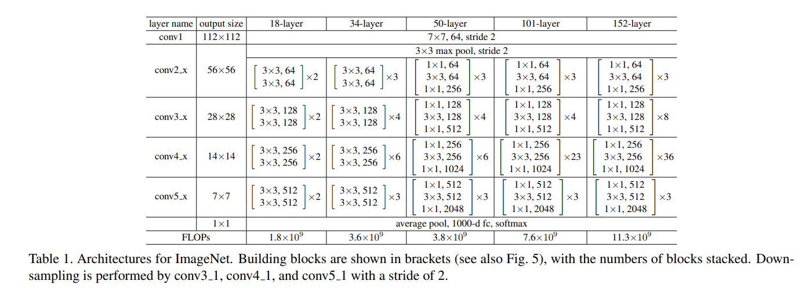

# Residual Neural Network
From: "[Deep Residual Learning for Image Recognition](https://arxiv.org/abs/1512.03385)"

**Disclaimer:**
The code is from the codebase of the Pytorch framework in the [torchvision library](https://github.com/pytorch/vision/blob/2c127da8b5e2e8f44b50994c6cb931bcca267cfe/torchvision/models/resnet.py#L356).

We've trimmed down the resnet.py file for readability and broke down the call stack from the Pytorch API.

This isn't useable code, however it's more understandable.

## Pytorch ResNet API Usage
In this section we will explore how the resnet neural network is used in the torchvision library.


If we look at this example in the [Pytorch tutorial documentation](https://pytorch.org/vision/main/auto_examples/others/plot_scripted_tensor_transforms.html#sphx-glr-auto-examples-others-plot-scripted-tensor-transforms-py) we get this snippet of code tha shows how the resnet18 version is used:

```python
from torchvision.models import resnet18, ResNet18_Weights


class Predictor(nn.Module):

    def __init__(self):
        super().__init__()
        weights = ResNet18_Weights.DEFAULT
        self.resnet18 = resnet18(weights=weights, progress=False).eval()
        self.transforms = weights.transforms(antialias=True)

    def forward(self, x: torch.Tensor) -> torch.Tensor:
        with torch.no_grad():
            x = self.transforms(x)
            y_pred = self.resnet18(x)
            return y_pred.argmax(dim=1)

device = "cuda" if torch.cuda.is_available() else "cpu"

predictor = Predictor().to(device)
scripted_predictor = torch.jit.script(predictor).to(device)

batch = torch.stack([dog1, dog2]).to(device)

res = predictor(batch)
res_scripted = scripted_predictor(batch)
```

Let's look at the breakdown of each sections:

**1. Import**
```python
from torchvision.models import resnet18, ResNet18_Weights
```

We are importing two element from the model library we will be exploring:
- `resnet18` : the main entry point to build a resnet model
- `ResNet18_Weights` : the training weights reproduced from the main paper "[Deep Residual Learning for Image Recognition](https://arxiv.org/abs/1512.03385)"


**2. Model Creation**
```python
    def __init__(self):
        super().__init__()
        weights = ResNet18_Weights.DEFAULT
        self.resnet18 = resnet18(weights=weights, progress=False).eval()
        self.transforms = weights.transforms(antialias=True)
```

The important part from this section is this sub-section:
```python
        weights = ResNet18_Weights.DEFAULT
        self.resnet18 = resnet18(weights=weights, progress=False).eval()
```

We first get the weights and pass it to the resnet18 API to create the model with the right pre-trained parameters.

The parameter of interest for this API are:

- **weights (ResNet18_Weights, optional)**: The pretrained weights to use. See ResNet18_Weights below for more details, and possible values. By default, no pre-trained weights are used.
- **progress (bool, optional)**: If True, displays a progress bar of the download to stderr. Default is True.

*[Taken from the Pytorch documentation](https://pytorch.org/vision/main/models/generated/torchvision.models.resnet18.html)*

**3. Trained Model Useage**
```python
            y_pred = self.resnet18(x)
```

Once the model is ready and trained we only need to pass the input `x` and we get the prediction `y`.

So that's pretty much it from the high level overview useage, let's go a bit deeper and explore the **resnet18 function**.

## resnet18 (API facing function)
Isolating the `resnet18` component inside the library we get the following:


```python
@register_model()
@handle_legacy_interface(weights=("pretrained", ResNet18_Weights.IMAGENET1K_V1))
def resnet18(*, weights: Optional[ResNet18_Weights] = None, progress: bool = True, **kwargs: Any) -> ResNet:
    """ResNet-18 from `Deep Residual Learning for Image Recognition <https://arxiv.org/abs/1512.03385>`__.

    Args:
        weights (:class:`~torchvision.models.ResNet18_Weights`, optional): The
            pretrained weights to use. See
            :class:`~torchvision.models.ResNet18_Weights` below for
            more details, and possible values. By default, no pre-trained
            weights are used.
        progress (bool, optional): If True, displays a progress bar of the
            download to stderr. Default is True.
        **kwargs: parameters passed to the ``torchvision.models.resnet.ResNet``
            base class. Please refer to the `source code
            <https://github.com/pytorch/vision/blob/main/torchvision/models/resnet.py>`_
            for more details about this class.

    .. autoclass:: torchvision.models.ResNet18_Weights
        :members:
    """
    weights = ResNet18_Weights.verify(weights)

    return _resnet(BasicBlock, [2, 2, 2, 2], weights, progress, **kwargs)
```

Most of it is just documentation we've already discussed above, let's trim it down:

```python
@register_model()
@handle_legacy_interface(weights=("pretrained", ResNet18_Weights.IMAGENET1K_V1))
def resnet18(*, weights: Optional[ResNet18_Weights] = None, progress: bool = True, **kwargs: Any) -> ResNet:
    weights = ResNet18_Weights.verify(weights)

    return _resnet(BasicBlock, [2, 2, 2, 2], weights, progress, **kwargs)

```

Removing even more parameters that pertain to the library only (like `register_model` and `handle_legacy_interface`), we get the following:

```python
def resnet18(weights: Optional[ResNet18_Weights] = None, progress: bool = True):
    weights = ResNet18_Weights.verify(weights)
    return _resnet(BasicBlock, [2, 2, 2, 2], weights, progress)
```

Which is much more manageable to understand.

Let's go through the function.

In a nutshell, we are passing the parameters we already discussed (i.e. `weights` and `progress`) then:
1. We verify if the weights are legit.
2. Then we call an internal `_resnet` class to start building our resnet with the right parameters.

Let's explore both the `verify` function and the `_resnet` class:

## ResNet18_weights.verify() (helper function):
In the [API documentation](https://pytorch.org/vision/main/_modules/torchvision/models/_api.html) we find that the function being called in this instance is checking if the weights have the right class name.

```python
class WeightsEnum(Enum):
    """
    This class is the parent class of all model weights. Each model building method receives an optional `weights`
    parameter with its associated pre-trained weights. It inherits from `Enum` and its values should be of type
    `Weights`.

    Args:
        value (Weights): The data class entry with the weight information.
    """

    @classmethod
    def verify(cls, obj: Any) -> Any:
        if obj is not None:
            if type(obj) is str:
                obj = cls[obj.replace(cls.__name__ + ".", "")]
            elif not isinstance(obj, cls):
                raise TypeError(
                    f"Invalid Weight class provided; expected {cls.__name__} but received {obj.__class__.__name__}."
                )
        return obj
```
Nothing too relevant for our understanding of resnet, this is more of a Pytorch specific internal safety check.

## _resnet (internal function)
What we call this internal class for is to do this:
```python
return _resnet(BasicBlock, [2, 2, 2, 2], weights, progress)
```

Let's break open up the function to check what `_resnet` is all about:

```python
def _resnet(
    block: Type[Union[BasicBlock, Bottleneck]],
    layers: List[int],
    weights: Optional[WeightsEnum],
    progress: bool,
    **kwargs: Any,
) -> ResNet:
    if weights is not None:
        _ovewrite_named_param(kwargs, "num_classes", len(weights.meta["categories"]))

    model = ResNet(block, layers, **kwargs)

    if weights is not None:
        model.load_state_dict(weights.get_state_dict(progress=progress, check_hash=True))

    return model
```

We have the following parameters of interest (with unfortunately not much documentation):
- **block** :  this is either a BasicBlock or a Bottleneck block like in the original resnet paper.
- **layers**: layers parameter for yet another core internal model
- **weights**: the weights to initalize a pre-trained model.

If we remove the weights checking code and the loading of the weights function we get only this:

```python
    model = ResNet(block, layers, weights, **kwargs)
```

Which means that there is the `ResNet` class that we need to have to investigate further.

**Quick Note:**
I know it seems like it's a bit convoluted, but at this point we are getting into the core of resnet. Getting there!

## ResNet (class)

The full ResNet code is the following:

```python
class ResNet(nn.Module):
    def __init__(
        self,
        block: Type[Union[BasicBlock, Bottleneck]],
        layers: List[int],
        num_classes: int = 1000,
        zero_init_residual: bool = False,
        groups: int = 1,
        width_per_group: int = 64,
        replace_stride_with_dilation: Optional[List[bool]] = None,
        norm_layer: Optional[Callable[..., nn.Module]] = None,
    ) -> None:
        super().__init__()
        _log_api_usage_once(self)
        if norm_layer is None:
            norm_layer = nn.BatchNorm2d
        self._norm_layer = norm_layer

        self.inplanes = 64
        self.dilation = 1
        if replace_stride_with_dilation is None:
            # each element in the tuple indicates if we should replace
            # the 2x2 stride with a dilated convolution instead
            replace_stride_with_dilation = [False, False, False]
        if len(replace_stride_with_dilation) != 3:
            raise ValueError(
                "replace_stride_with_dilation should be None "
                f"or a 3-element tuple, got {replace_stride_with_dilation}"
            )
        self.groups = groups
        self.base_width = width_per_group
        self.conv1 = nn.Conv2d(3, self.inplanes, kernel_size=7, stride=2, padding=3, bias=False)
        self.bn1 = norm_layer(self.inplanes)
        self.relu = nn.ReLU(inplace=True)
        self.maxpool = nn.MaxPool2d(kernel_size=3, stride=2, padding=1)
        self.layer1 = self._make_layer(block, 64, layers[0])
        self.layer2 = self._make_layer(block, 128, layers[1], stride=2, dilate=replace_stride_with_dilation[0])
        self.layer3 = self._make_layer(block, 256, layers[2], stride=2, dilate=replace_stride_with_dilation[1])
        self.layer4 = self._make_layer(block, 512, layers[3], stride=2, dilate=replace_stride_with_dilation[2])
        self.avgpool = nn.AdaptiveAvgPool2d((1, 1))
        self.fc = nn.Linear(512 * block.expansion, num_classes)

        for m in self.modules():
            if isinstance(m, nn.Conv2d):
                nn.init.kaiming_normal_(m.weight, mode="fan_out", nonlinearity="relu")
            elif isinstance(m, (nn.BatchNorm2d, nn.GroupNorm)):
                nn.init.constant_(m.weight, 1)
                nn.init.constant_(m.bias, 0)

        # Zero-initialize the last BN in each residual branch,
        # so that the residual branch starts with zeros, and each residual block behaves like an identity.
        # This improves the model by 0.2~0.3% according to https://arxiv.org/abs/1706.02677
        if zero_init_residual:
            for m in self.modules():
                if isinstance(m, Bottleneck) and m.bn3.weight is not None:
                    nn.init.constant_(m.bn3.weight, 0)  # type: ignore[arg-type]
                elif isinstance(m, BasicBlock) and m.bn2.weight is not None:
                    nn.init.constant_(m.bn2.weight, 0)  # type: ignore[arg-type]

    def _make_layer(
        self,
        block: Type[Union[BasicBlock, Bottleneck]],
        planes: int,
        blocks: int,
        stride: int = 1,
        dilate: bool = False,
    ) -> nn.Sequential:
        norm_layer = self._norm_layer
        downsample = None
        previous_dilation = self.dilation
        if dilate:
            self.dilation *= stride
            stride = 1
        if stride != 1 or self.inplanes != planes * block.expansion:
            downsample = nn.Sequential(
                conv1x1(self.inplanes, planes * block.expansion, stride),
                norm_layer(planes * block.expansion),
            )

        layers = []
        layers.append(
            block(
                self.inplanes, planes, stride, downsample, self.groups, self.base_width, previous_dilation, norm_layer
            )
        )
        self.inplanes = planes * block.expansion
        for _ in range(1, blocks):
            layers.append(
                block(
                    self.inplanes,
                    planes,
                    groups=self.groups,
                    base_width=self.base_width,
                    dilation=self.dilation,
                    norm_layer=norm_layer,
                )
            )

        return nn.Sequential(*layers)

    def _forward_impl(self, x: Tensor) -> Tensor:
        # See note [TorchScript super()]
        x = self.conv1(x)
        x = self.bn1(x)
        x = self.relu(x)
        x = self.maxpool(x)

        x = self.layer1(x)
        x = self.layer2(x)
        x = self.layer3(x)
        x = self.layer4(x)

        x = self.avgpool(x)
        x = torch.flatten(x, 1)
        x = self.fc(x)

        return x

    def forward(self, x: Tensor) -> Tensor:
        return self._forward_impl(x)
```

Looking generally at the functions we have:
- `__init__` : The constructor for this class which we called in the previous `_resnet` function
- `_make_layer`: internal function to build the layers with the right specification
- `_forward_impl`: the actual implementation of the forward pass
- `forward`: forward pass that is called by Pytorch during training and evaluation

Let's look at each of the element:

## ResNet | forward
```python
def forward(self, x: Tensor) -> Tensor:
        return self._forward_impl(x)
```

Pretty self explanatory, this is simply a wrapper function over the internal function `_forward_impl` .
The reason for this structure has to do with Pytorch internals.

## ResNet | _forward_impl
```python
    def _forward_impl(self, x: Tensor) -> Tensor:
        # See note [TorchScript super()]
        x = self.conv1(x)
        x = self.bn1(x)
        x = self.relu(x)
        x = self.maxpool(x)

        x = self.layer1(x)
        x = self.layer2(x)
        x = self.layer3(x)
        x = self.layer4(x)

        x = self.avgpool(x)
        x = torch.flatten(x, 1)
        x = self.fc(x)

        return x

```
All ResNet no matter their depth have the same structure, shown here:


We have:
1. `conv1`: convolutional layer
2. `bn1`: using batch normalization
3. `relu`: with relu
4. `maxpool`: then a maxpooling layer

Followed by four "chunky" layers that house the residual blocks:

5. `layer1 to 4`

Finally, after going through the blocks we always finish up with:

6. `avgpool`: average pooling layer with a flattening to 1 dimension
7. `fc`: fully connected layer for the output

The main differences in all size of Residual Neural Network will boils down to how the middle portion is built out:
```python
        x = self.layer1(x)
        x = self.layer2(x)
        x = self.layer3(x)
        x = self.layer4(x)
```

Which is where the idea of bypassing connections comes from.

## ResNet | _make_layer

# Extra Resource
- [interesting paper](https://blog.paperspace.com/writing-resnet-from-scratch-in-pytorch/)