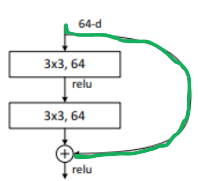
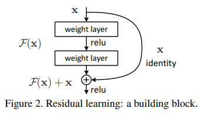
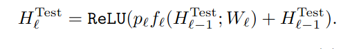

# Stochastic Depth
We'll be breaking down the code from this [repository](https://github.com/shamangary/Pytorch-Stochastic-Depth-Resnet/blob/master/TYY_stodepth_lineardecay.py) which makes use of linear decay stochastic depth.

Note: I've trimmed down the whole library so that we can solely focus on the overall structure, we'll be exploring resnet 18.

## resnet18_StoDepth_lineardecay
Top level function to call to create the model as follow
```python
net = resnet18_StoDepth_lineardecay(pretrained=True, prob_0_L=[1,0.5], multFlag=True) 
```

The source code is like this:
```python
def resnet18_StoDepth_lineardecay(pretrained=False, prob_0_L=[1,0.5], multFlag=True, **kwargs):
    """Constructs a ResNet_StoDepth_lineardecay-18 model.
    Args:
        pretrained (bool): If True, returns a model pre-trained on ImageNet
    """
    model = ResNet_StoDepth_lineardecay(StoDepth_BasicBlock, prob_0_L, multFlag, [2, 2, 2, 2], **kwargs)
    if pretrained:
        model.load_state_dict(model_zoo.load_url(model_urls['resnet18']))
    return model
```

This isn't an official Pytorch implementation so the nomenclature are a bit different than usual, here is what the parameters means:
- `pretrained`: define if we need to load the model weight already pre-trained.
- `prob_0_L`: this is two numbers which are the starting  and the end survival probability for a given layer (note: should have been two parameters).
- `multFlag`: parameter to do or not the multiplication at test time.

Within this function the interesting bit for us is this one:
```python
    model = ResNet_StoDepth_lineardecay(StoDepth_BasicBlock, prob_0_L, multFlag, [2, 2, 2, 2], **kwargs)
```

Before diving into this function, we'll take a look at how the basic block of the ResNet hass been modified to match the residual depth procedure.

## StoDepth_BasicBlock

```python

class StoDepth_BasicBlock(nn.Module):
    expansion = 1

    def __init__(self, prob, multFlag, inplanes, planes, stride=1, downsample=None):
        super(StoDepth_BasicBlock, self).__init__()
        self.conv1 = conv3x3(inplanes, planes, stride)
        self.bn1 = nn.BatchNorm2d(planes)
        self.relu = nn.ReLU(inplace=True)
        self.conv2 = conv3x3(planes, planes)
        self.bn2 = nn.BatchNorm2d(planes)
        self.downsample = downsample
        self.stride = stride
        self.prob = prob
        self.m = torch.distributions.bernoulli.Bernoulli(torch.Tensor([self.prob]))
        self.multFlag = multFlag

    def forward(self, x):
        
        identity = x.clone()

        if self.training:
            if torch.equal(self.m.sample(),torch.ones(1)):

                self.conv1.weight.requires_grad = True
                self.conv2.weight.requires_grad = True

                out = self.conv1(x)
                out = self.bn1(out)
                out = self.relu(out)
                out = self.conv2(out)
                out = self.bn2(out)

                if self.downsample is not None:
                    identity = self.downsample(x)

                out += identity
            else:
                # Resnet does not use bias terms
                self.conv1.weight.requires_grad = False
                self.conv2.weight.requires_grad = False
                
                if self.downsample is not None:
                    identity = self.downsample(x)

                out = identity
        else:
            

            out = self.conv1(x)
            out = self.bn1(out)
            out = self.relu(out)
            out = self.conv2(out)
            out = self.bn2(out)

            if self.downsample is not None:
                identity = self.downsample(x)

            if self.multFlag:
                out = self.prob*out + identity
            else:
                out = out + identity

        out = self.relu(out)

        return out

```

There is two function of interest here, the initialization and the forward function.
Let's look at each of them.

## StoDepth_BasicBlock | __init__

```python
    def __init__(self, prob, multFlag, inplanes, planes, stride=1, downsample=None):
        super(StoDepth_BasicBlock, self).__init__()
        self.conv1 = conv3x3(inplanes, planes, stride)
        self.bn1 = nn.BatchNorm2d(planes)
        self.relu = nn.ReLU(inplace=True)
        self.conv2 = conv3x3(planes, planes)
        self.bn2 = nn.BatchNorm2d(planes)
        self.downsample = downsample
        self.stride = stride
        self.prob = prob
        self.m = torch.distributions.bernoulli.Bernoulli(torch.Tensor([self.prob]))
        self.multFlag = multFlag
```

This is fairly standard initialization, except for this tensor:
```python
        self.m = torch.distributions.bernoulli.Bernoulli(torch.Tensor([self.prob]))
```
This obscure variable is extremly important as its the one that will define whether the layer will get bypassed or not.
We are using a bernoulli distribution to have an output that is either 0 (bypassed) or 1 (not bypassed) following a probability `prob`.

Let's use these variables in the `forward` function

## StoDepth_BasicBlock | forward

```python
    def forward(self, x):
        
        identity = x.clone()

        if self.training:
            if torch.equal(self.m.sample(),torch.ones(1)):

                self.conv1.weight.requires_grad = True
                self.conv2.weight.requires_grad = True

                out = self.conv1(x)
                out = self.bn1(out)
                out = self.relu(out)
                out = self.conv2(out)
                out = self.bn2(out)

                if self.downsample is not None:
                    identity = self.downsample(x)

                out += identity
            else:
                # Resnet does not use bias terms
                self.conv1.weight.requires_grad = False
                self.conv2.weight.requires_grad = False
                
                if self.downsample is not None:
                    identity = self.downsample(x)

                out = identity
        else:
            

            out = self.conv1(x)
            out = self.bn1(out)
            out = self.relu(out)
            out = self.conv2(out)
            out = self.bn2(out)

            if self.downsample is not None:
                identity = self.downsample(x)

            if self.multFlag:
                out = self.prob*out + identity
            else:
                out = out + identity

        out = self.relu(out)

        return out
```

The first step is to modify the input x so that we can use it as the `identity` element of the resnet:

```python
        identity = x.clone()
```



Then, we will go either into the training motion or the testing one.
Remember, the whole purpose of the paper is to have a **short** network at training time and a **big** network at testing time.

Therefore, inside the layers we will either shut off the layer with probability of survival `prob` during training or using all the layers during testing.

## StoDepth_BasicBlock | forward | training loop

```python
        if self.training:
            if torch.equal(self.m.sample(),torch.ones(1)):

                self.conv1.weight.requires_grad = True
                self.conv2.weight.requires_grad = True

                out = self.conv1(x)
                out = self.bn1(out)
                out = self.relu(out)
                out = self.conv2(out)
                out = self.bn2(out)

                if self.downsample is not None:
                    identity = self.downsample(x)

                out += identity
            else:
                # Resnet does not use bias terms
                self.conv1.weight.requires_grad = False
                self.conv2.weight.requires_grad = False
                
                if self.downsample is not None:
                    identity = self.downsample(x)

                out = identity

```

In this loop, the author decided to split the action depending if the bernoulli random variable is 1 or 0.

**Note:** This might not be the best way to implement this branch because technically you don't need to have this level of separation. You could theorically structure this motion by always having the bernoulli tensor multiplying the output like in the official pytorch doc:

```python
[docs]def stochastic_depth(input: Tensor, p: float, mode: str, training: bool = True) -> Tensor:
    """
    Implements the Stochastic Depth from `"Deep Networks with Stochastic Depth"
    <https://arxiv.org/abs/1603.09382>`_ used for randomly dropping residual
    branches of residual architectures.

    Args:
        input (Tensor[N, ...]): The input tensor or arbitrary dimensions with the first one
                    being its batch i.e. a batch with ``N`` rows.
        p (float): probability of the input to be zeroed.
        mode (str): ``"batch"`` or ``"row"``.
                    ``"batch"`` randomly zeroes the entire input, ``"row"`` zeroes
                    randomly selected rows from the batch.
        training: apply stochastic depth if is ``True``. Default: ``True``

    Returns:
        Tensor[N, ...]: The randomly zeroed tensor.
    """
    #[...]

    survival_rate = 1.0 - p

    noise = torch.empty(size, dtype=input.dtype, device=input.device)

    noise = noise.bernoulli_(survival_rate) # <---------------------------------- HERE
    if survival_rate > 0.0:
        noise.div_(survival_rate) # <----------------------------------------------HERE
    return input * noise # <--------------------------------------------------------AND HERE

```

Anyway, let's keep going.

How we are making the distinction about the two case is with this if statement:
```python
if torch.equal(self.m.sample(),torch.ones(1)):
```
If the `m` tensor is equal to 1 then it's fine, we don't need to skip the layer.
```python
                self.conv1.weight.requires_grad = True
                self.conv2.weight.requires_grad = True

                out = self.conv1(x)
                out = self.bn1(out)
                out = self.relu(out)
                out = self.conv2(out)
                out = self.bn2(out)

                if self.downsample is not None:
                    identity = self.downsample(x)

                out += identity
```
We do all the normal resnet stuff with the bypassing and such, like in this image:



If we need to bypass then we don't do any of the convolution motion:

```python
            else:
                # Resnet does not use bias terms
                self.conv1.weight.requires_grad = False
                self.conv2.weight.requires_grad = False
                
                if self.downsample is not None:
                    identity = self.downsample(x)

                out = identity
```
Which basically means, output the `x` that we cloned earlier.

## StoDepth_BasicBlock | forward | testing loop
For the testing loop we have the following:

```python
        else:
            

            out = self.conv1(x)
            out = self.bn1(out)
            out = self.relu(out)
            out = self.conv2(out)
            out = self.bn2(out)

            if self.downsample is not None:
                identity = self.downsample(x)

            if self.multFlag:
                out = self.prob*out + identity
            else:
                out = out + identity
```

Here we do the normal resnet stuff up until this part:
```python
        if self.multFlag:
                out = self.prob*out + identity
            else:
                out = out + identity
```
In the original paper we have this formula for the testing phase:



Which basically says that we should multiply the probability of survival with the output of the convolutions and then add identiy.

However, the author of the repository we took this code from saw that doing so might deteriorate the performance.
Therfore they give you a way to use that method or simply use the normal resnet formula that don't make use of the probability of survival of a layer.

And that' it for the forward and BasicBlock class!

Let's check out now the Stochastic Depth Resnet class:
## ResNet_StoDepth_lineardecay
